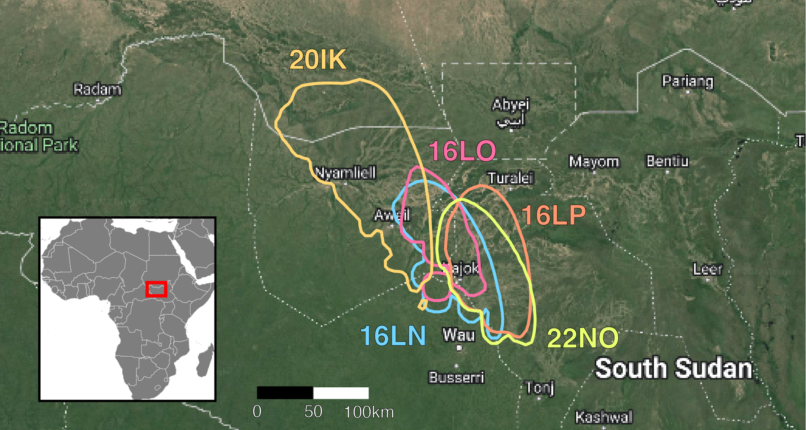

## Non-breeding site



## Trajectories

{width="438"}


## Automatic Report

```{r, results = "asis", echo = FALSE}
# List all the html file found on in the reports/html folder
f <- list.files(path = ".", patter="*.html",recursive = TRUE)

f_dirname <- lapply(f,dirname)
f_basename <- lapply(f,basename)

for (i_f_dir in unique(f_dirname)) {
  cat(paste("### ", tools::toTitleCase(stringr::str_replace_all(i_f_dir, "_", " "))))
  cat("\n")
  for (i_f in seq_len(length(f))) {
    if (f_dirname[[i_f]] == i_f_dir) {
      cat(paste("* <a href='", f[[i_f]], "'>", sub("\\.html$", "", f_basename[[i_f]]), "</a>"), sep = "\n")
    }
  }
  cat("\n")
}
```

More technical details on the tracks:

```{r, results = "asis", echo = FALSE}
f <- list.files(path = "technical_details/", patter = "*.html", recursive = TRUE)
f_basename <- lapply(f, basename)
for (i_f in seq_len(length(f))) {
      cat(paste("* <a href='technical_details/", f[[i_f]], "'>", sub("\\.html$", "", f_basename[[i_f]]), "</a>"), sep = "\n")
}
```
